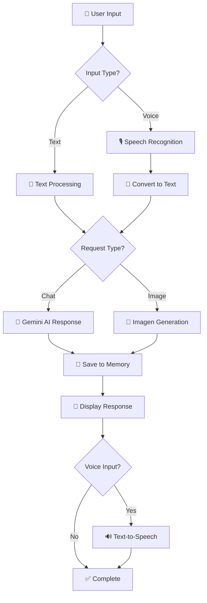

<div align="center">

# 🌟 Chandre The GPT


### 🚀 Advanced AI-powered chatbot with voice interaction and image generation capabilities

*Built with Streamlit and Google's Gemini AI*

[🎯 Demo](#-demo) • [⚡ Quick Start](#-quick-start) • [📖 Documentation](#-usage) • [🤝 Contributing](#-contributing)

---

</div>

## 🎯 Demo

<div align="center">


*Replace this placeholder with actual screenshots of your app*

</div>

## ✨ Key Features

<div align="center">

| 🎯 Feature | 📝 Description | 🔧 Technology |
|------------|----------------|---------------|
| 💬 **Smart Chat** | Intelligent conversations with context memory | Google Gemini 1.5 Flash |
| 🎙️ **Voice Input** | Speak naturally and get voice responses | Speech Recognition + gTTS |
| 🎨 **Image Generation** | Create stunning visuals from text prompts | Google Imagen 3.0 |
| 📱 **Modern UI** | Beautiful, responsive interface | Custom CSS + Streamlit |
| 🔊 **Text-to-Speech** | Automatic voice playback for responses | Google TTS |
| 💾 **Memory** | Maintains conversation context | LangChain Memory |

</div>

## 🏗️ How It Works

<div align="center">



</div>

## ⚡ Quick Start

<div align="center">

### 🛠️ Prerequisites


</div>

### 📦 Installation Steps

<details>
<summary>🔽 Click to expand installation guide</summary>

#### 1️⃣ Clone the Repository
```bash
git clone https://github.com/yourusername/chandre-the-gpt.git
cd chandre-the-gpt
```

#### 2️⃣ Create Virtual Environment (Recommended)
```bash
python -m venv venv
source venv/bin/activate  # On Windows: venv\Scripts\activate
```

#### 3️⃣ Install Dependencies
```bash
pip install -r requirements.txt
```

#### 4️⃣ Install FFmpeg
<div align="center">

| OS | Command |
|---|---|
| 🍎 **macOS** | `brew install ffmpeg` |
| 🐧 **Ubuntu/Debian** | `sudo apt install ffmpeg` |
| 🪟 **Windows** | [Download from FFmpeg.org](https://ffmpeg.org/download.html) |

</div>

#### 5️⃣ Get API Key
1. Visit [Google AI Studio](https://makersuite.google.com/app/apikey)
2. Create a new API key
3. Copy the key for the next step

#### 6️⃣ Run the Application
```bash
streamlit run app.py
```

</details>

## 🎮 Setup & Usage

<div align="center">

### 🔧 Initial Setup


</div>

1. **🌐 Open Application**: Navigate to `http://localhost:8501`
2. **🔑 Add API Key**: Enter your Gemini API key in the sidebar
3. **🎉 Start Chatting**: You're ready to go!

---

## 📖 Usage Guide

<div align="center">

### 💬 Text Chat


- Type messages in the input box
- Get intelligent AI responses
- Context is maintained throughout conversation

</div>

<div align="center">

### 🎙️ Voice Interaction


- Click 🎙️ to start recording
- Speak clearly and naturally
- Get automatic voice responses

</div>

<div align="center">

### 🎨 Image Generation


**Trigger Words**: `draw`, `generate image`, `create picture`, `show me`

**Example Prompts**:
- *"Draw a futuristic cityscape"*
- *"Generate image of a sunset over mountains"*
- *"Create a picture of a cute robot"*

</div>

## 🛠️ Technical Stack

<div align="center">

### Core Technologies


### Dependencies Overview

```python
# 🔧 Core Framework
streamlit                    # Web interface
streamlit-mic-recorder      # Voice recording

# 🤖 AI & ML
google-generativeai         # Gemini AI
langchain-google-genai      # LangChain integration
langchain                   # Memory management

# 🎵 Audio Processing
speech-recognition          # Speech to text
gtts                       # Text to speech
pydub                      # Audio manipulation

# 🎨 Image Processing
pillow                     # Image handling
requests                   # API calls
```

</div>

## 📁 Project Architecture

<div align="center">

```
📦 chandre-the-gpt/
├── 🐍 app.py              # Main application file
├── 📋 requirements.txt    # Python dependencies  
├── 📖 README.md          # Project documentation
├── 📄 LICENSE            # License file
├── 🖼️  assets/           # Screenshots & media
│   ├── demo.png          # Demo screenshot
│   ├── voice-demo.gif    # Voice interaction demo
│   └── ui-preview.png    # UI preview
└── 📚 docs/              # Additional documentation
    ├── setup-guide.md    # Detailed setup guide
    └── api-reference.md  # API documentation
```

</div>

## 🔬 Advanced Features

<details>
<summary>🔽 Click to explore advanced capabilities</summary>

### 🧠 AI Intelligence
- **Context Awareness**: Remembers conversation history
- **Smart Routing**: Automatically detects image vs text requests
- **Response Optimization**: Concise responses unless detail requested
- **Error Handling**: Graceful failure recovery

### 🎨 UI/UX Excellence
- **Responsive Design**: Works on desktop, tablet, and mobile
- **WhatsApp-style Bubbles**: Familiar chat interface
- **Smooth Animations**: Polished user interactions
- **Accessibility**: Keyboard navigation and screen reader support

### 🔊 Audio Processing
- **Noise Reduction**: Ambient noise filtering
- **Multi-format Support**: WebM, WAV, MP3 compatibility
- **Real-time Processing**: Instant voice recognition
- **Auto-play Control**: Smart TTS activation

### 🖼️ Image Generation
- **High Quality**: Powered by Imagen 3.0
- **Smart Prompting**: Enhanced prompt engineering
- **Multiple Formats**: PNG, JPEG support
- **Instant Preview**: Real-time image display

</details>

## 🎨 Features in Detail

### Smart AI Responses
- Context-aware conversations using LangChain memory
- Optimized prompts for helpful, concise responses
- Automatic detection of image generation requests

### Voice Processing
- Real-time speech recognition using Google Speech API
- WebM audio format support with automatic conversion
- Ambient noise adjustment for better accuracy

### Modern UI/UX
- Responsive chat interface
- WhatsApp-style message bubbles
- Smooth animations and hover effects
- Fixed input area for better mobile experience

## 🚨 Troubleshooting

<div align="center">

### 🔧 Common Issues & Solutions

</div>

<details>
<summary>🎙️ Audio Issues</summary>

**Problem**: Microphone not working
- ✅ **Solution**: Check browser microphone permissions
- ✅ **Solution**: Ensure FFmpeg is properly installed
- ✅ **Solution**: Try refreshing the page
- ✅ **Solution**: Test with different browsers

**Problem**: Poor voice recognition
- ✅ **Solution**: Speak clearly and slowly
- ✅ **Solution**: Reduce background noise
- ✅ **Solution**: Check microphone quality

</details>

<details>
<summary>🤖 API Issues</summary>

**Problem**: API key errors
- ✅ **Solution**: Verify API key is correct and active
- ✅ **Solution**: Check API quota and billing
- ✅ **Solution**: Ensure internet connection is stable

**Problem**: Slow responses
- ✅ **Solution**: Check internet speed
- ✅ **Solution**: Try during off-peak hours
- ✅ **Solution**: Reduce prompt complexity

</details>

<details>
<summary>🎨 Image Generation Issues</summary>

**Problem**: Images not generating
- ✅ **Solution**: Use clear image-related keywords
- ✅ **Solution**: Check API permissions for Imagen
- ✅ **Solution**: Try rephrasing your request
- ✅ **Solution**: Ensure prompt is not too complex

</details>

<details>
<summary>🖥️ Installation Issues</summary>

**Problem**: Dependencies not installing
- ✅ **Solution**: Use virtual environment
- ✅ **Solution**: Update pip: `pip install --upgrade pip`
- ✅ **Solution**: Try: `pip install --no-cache-dir -r requirements.txt`

**Problem**: Streamlit won't start
- ✅ **Solution**: Check Python version (3.7+)
- ✅ **Solution**: Try: `python -m streamlit run app.py`
- ✅ **Solution**: Clear streamlit cache: `streamlit cache clear`

</details>

## 🤝 Contributing

<div align="center">

### 🌟 We Welcome Contributors!


</div>

### 🛠️ How to Contribute

1. **🍴 Fork** the repository
2. **🌿 Create** a feature branch
   ```bash
   git checkout -b feature/amazing-feature
   ```
3. **✨ Make** your changes
4. **💾 Commit** your changes
   ```bash
   git commit -m '✨ Add amazing feature'
   ```
5. **🚀 Push** to the branch
   ```bash
   git push origin feature/amazing-feature
   ```
6. **📝 Create** a Pull Request

### 🎯 Contribution Ideas

- 🎨 **UI/UX Improvements**: Better animations, themes, layouts
- 🔧 **Features**: New AI capabilities, integrations, tools
- 🐛 **Bug Fixes**: Report and fix issues
- 📚 **Documentation**: Improve guides, add tutorials
- 🧪 **Testing**: Add unit tests, integration tests
- 🌐 **Localization**: Multi-language support

### 👥 Contributors

<div align="center">

*Be the first to contribute and see your name here!*


</div>

---

## 📄 License

<div align="center">


This project is licensed under the **MIT License** - see the [LICENSE](LICENSE) file for details.

</div>

## 🙏 Acknowledgments

<div align="center">

### 🌟 Special Thanks

**🤖 AI Partners**
- [Google Gemini AI](https://ai.google.dev/) - Powering conversations and image generation
- [Google Cloud Speech-to-Text](https://cloud.google.com/speech-to-text) - Voice recognition
- [Google Text-to-Speech](https://cloud.google.com/text-to-speech) - Voice synthesis

**🛠️ Technology Stack**
- [Streamlit](https://streamlit.io/) - Amazing web framework
- [LangChain](https://python.langchain.com/) - AI application framework
- [FFmpeg](https://ffmpeg.org/) - Multimedia processing

**👥 Community**
- All the open-source contributors
- The Streamlit community
- Beta testers and feedback providers

</div>

---

## 📞 Support & Contact

<div align="center">

### 💬 Get Help


**Need help?** Here's how to get support:

1. 📖 **Check Documentation**: Review this README and troubleshooting guide
2. 🔍 **Search Issues**: Look for existing solutions in GitHub issues
3. 🆕 **Create Issue**: Open a new issue with detailed information
4. 💬 **Join Discussion**: Participate in GitHub discussions

### 📊 Project Stats


</div>

---

<div align="center">

### 🚀 Ready to get started?

**[⬆️ Back to Top](#-chandre-the-gpt)** • **[🎯 View Demo](#-demo)** • **[⚡ Quick Start](#-quick-start)**

---

**Built with ❤️ using Streamlit and Google Gemini AI**


### ⭐ Don't forget to star this repo if you found it helpful!

</div>