<div align="center">

# 🌟 Chandre The GPT


### 🚀 Advanced AI-powered chatbot with voice interaction and image generation capabilities

*Built with Streamlit and Google's Gemini AI*

[🌐 Live Demo](https://chandreai.streamlit.app/) • [⚡ Quick Start](#-quick-start) • [📖 Documentation](#-usage) • [🤝 Contributing](#-contributing)

---

</div>

## 🎯 Two Revolutionary Implementations

<div align="center">

<table>
<tr>
<td align="center" width="50%">

### 🖥️ **Native Desktop Version**
#### *This Repository - Ultimate Performance*

🎙️ **Advanced Voice Processing**<br/>
Professional FFmpeg audio handling

🎨 **Voice-to-Image Generation**<br/>
Speak and see your ideas instantly

🧠 **Persistent Memory**<br/>
Advanced conversation context (text+voice)

⚡ **Zero Limitations**<br/>
Full desktop-class performance

[📥 **Install Locally**](#-installation)

</td>
<td align="center" width="50%">

### 🌐 **Web Version**
#### *Live Demo - Instant Access*

🚀 **Browser-Based Voice AI**<br/>
Revolutionary web audio integration

🎯 **No Installation Required**<br/>
Works on any device, anywhere<br>
Perfect Conversation in text and audio<br>
Generate great image with text input

🔗 **Easy Sharing**<br/>
Perfect for demonstrations

🔗 **Limitations**<br/>
Cannot generate image with voice,<br>
might show problem in ios


🌍 **Cross-Platform**<br/>
Phone, tablet, desktop compatible

[🌐 **Try Live Demo**](https://chandreai.streamlit.app/)

</td>
</tr>
</table>

</div>

## 🌟 What Makes This Special

### 🏔️ **The Challenge We Conquered**

Building advanced voice-to-image generation in a web browser seemed impossible:
- "Streamlit is just for dashboards"
- "Voice AI needs specialized platforms" 
- "Browser-based voice processing is too complex"

**We proved them wrong.**

### ⚡ **Technical Breakthroughs**

**🎙️ Web Audio Revolution**
- Real-time speech recognition without plugins
- Custom JavaScript + Streamlit integration
- Cross-browser voice compatibility

**🎨 Voice-to-Visual Pipeline**
- Natural language to image generation
- Direct voice command processing
- Intelligent multimodal routing

**🧠 Smart Architecture**
- Context-aware memory with LangChain
- Personality-driven AI responses
- Seamless native-web deployment

## 🎯 Demo

<div align="center">


*Clean, modern interface with WhatsApp-style chat bubbles*

</div>

## ✨ Core Features

<div align="center">

| 🎯 Feature | 📝 Description | 🔧 Technology |
|------------|----------------|---------------|
| 💬 **Smart Chat** | Context-aware conversations with memory | Google Gemini 1.5 Flash |
| 🎙️ **Voice Input** | Natural speech with voice responses | Speech Recognition + gTTS |
| 🎨 **Image Generation** | Create visuals from voice/text prompts | Google Imagen 3.0 |
| 📱 **Modern UI** | Responsive, beautiful interface | Custom CSS + Streamlit |
| 🔊 **Text-to-Speech** | Automatic voice playback | Google TTS |
| 💾 **Memory System** | Maintains conversation context | LangChain Memory |

</div>

## 🏗️ Architecture Overview

```mermaid
graph TD
    A[👤 User Input] --> B{Input Type?}
    B -->|Text| C[💬 Text Processing]
    B -->|Voice| D[🎙️ Speech Recognition]
    D --> E[📝 Convert to Text]
    C --> F{Request Type?}
    E --> F
    F -->|Chat| G[🤖 Gemini AI Response]
    F -->|Image| H[🎨 Imagen Generation]
    G --> I[💾 Save to Memory]
    H --> I
    I --> J[📱 Display Response]
    J --> K{Voice Input?}
    K -->|Yes| L[🔊 Text-to-Speech]
    K -->|No| M[✅ Complete]
    L --> M
```

<div align="center">



</div>

## ⚡ Quick Start

### 🌐 Try Web Version (Instant)

Visit **[chandreai.streamlit.app](https://chandreai.streamlit.app/)** - No installation required!

### 🖥️ Install Native Version (Full Features)

<details>
<summary>🔽 Click to expand installation guide</summary>

#### Prerequisites
- Python 3.7+
- FFmpeg (for advanced audio processing)
- Google Gemini API key

#### Installation Steps

1. **Clone Repository**
```bash
git clone https://github.com/yourusername/chandre-the-gpt.git
cd chandre-the-gpt
```

2. **Create Virtual Environment**
```bash
python -m venv venv
source venv/bin/activate  # Windows: venv\Scripts\activate
```

3. **Install Dependencies**
```bash
pip install -r requirements.txt
```

4. **Install FFmpeg**
- **macOS**: `brew install ffmpeg`
- **Ubuntu/Debian**: `sudo apt install ffmpeg`
- **Windows**: [Download from FFmpeg.org](https://ffmpeg.org/download.html)

5. **Get API Key**
- Visit [Google AI Studio](https://makersuite.google.com/app/apikey)
- Create and copy your API key

6. **Run Application**
```bash
streamlit run app.py
```

7. **Setup**
- Open `http://localhost:8501`
- Enter your API key in the sidebar
- Start chatting!

</details>

## 🛠️ Technical Stack

<div align="center">

### Core Technologies


</div>

### Key Dependencies
```python
# Core Framework
streamlit                    # Web interface
streamlit-mic-recorder      # Voice recording

# AI & ML
google-generativeai         # Gemini AI
langchain-google-genai      # LangChain integration
langchain                   # Memory management

# Audio Processing
speech-recognition          # Speech to text
gtts                       # Text to speech
pydub                      # Audio manipulation

# Image Processing
pillow                     # Image handling
requests                   # API calls
```

## 📖 Usage Guide

### 💬 **Text Chat**
- Type your message and press Enter
- AI responds with context awareness
- Conversation history is maintained

### 🎙️ **Voice Interaction**
- Click the microphone button
- Speak your message clearly
- Get voice responses automatically

### 🎨 **Image Generation**
- Say "create an image of..." or "generate..."
- Type image requests with descriptive prompts
- Get high-quality AI-generated images

### 🔧 **Advanced Features**
- **Context Memory**: AI remembers previous conversations
- **Smart Routing**: Automatically detects image vs text requests
- **Voice Control**: Full hands-free operation
- **Responsive Design**: Works on all devices

## 🚨 Troubleshooting

<details>
<summary>🎙️ Audio Issues</summary>

- **Microphone not working**: Check browser permissions, refresh page
- **Poor recognition**: Speak clearly, reduce background noise
- **No voice response**: Verify TTS settings, check internet connection

</details>

<details>
<summary>🤖 API Issues</summary>

- **API key errors**: Verify key is correct and active
- **Slow responses**: Check internet speed, try off-peak hours
- **Quota exceeded**: Check API billing and usage limits

</details>

<details>
<summary>🎨 Image Generation Issues</summary>

- **Images not generating**: Use clear image-related keywords
- **Poor quality**: Try more descriptive prompts
- **API errors**: Check Imagen API permissions

</details>

## 🤝 Contributing

We welcome contributions! Here's how to get started:

1. **Fork** the repository
2. **Create** a feature branch: `git checkout -b feature/amazing-feature`
3. **Make** your changes
4. **Test** thoroughly
5. **Commit**: `git commit -m '✨ Add amazing feature'`
6. **Push**: `git push origin feature/amazing-feature`
7. **Create** a Pull Request

 🌟 Collaboration Opportunities
🔗 Want to explore the web-based version?
Interested in learning how to build browser-based voice assistants that actually work? The web implementation solved problems most teams won't even attempt.
💡 Ready to push boundaries further?

Advanced voice processing techniques
Multi-modal AI architectures
Cross-platform AI deployment strategies
Streamlit application development beyond dashboards

📧 Let's connect! I'm always excited to collaborate with fellow innovators, guide ambitious projects, and share knowledge about bleeding-edge AI development.

### 🎯 Contribution Ideas
- 🎨 UI/UX improvements
- 🔧 New AI features
- 🐛 Bug fixes
- 📚 Documentation
- 🌐 Localization
- 🧪 Testing

## 📄 License

This project is licensed under the MIT License - see the [LICENSE](LICENSE) file for details.

## 🙏 Acknowledgments

**🤖 AI Partners**
- [Google Gemini AI](https://ai.google.dev/) - Powering conversations and images
- [Google Speech APIs](https://cloud.google.com/speech-to-text) - Voice processing

**🛠️ Technology Stack**
- [Streamlit](https://streamlit.io/) - Web framework
- [LangChain](https://python.langchain.com/) - AI framework
- [FFmpeg](https://ffmpeg.org/) - Audio processing

## 📞 Support

- 📖 **Documentation**: Check this README and troubleshooting guide
- 🔍 **Issues**: Search existing GitHub issues
- 🆕 **Bug Reports**: Create detailed issue reports
- 💬 **Discussions**: Join GitHub discussions

---

<div align="center">

### 🚀 Ready to Experience the Future of AI?

**[🌐 Try Web Demo](https://chandreai.streamlit.app/)** • **[📥 Install Locally](#-quick-start)** • **[⬆️ Back to Top](#-chandre-the-gpt)**

---

**Built with ❤️ using Streamlit and Google Gemini AI**


### ⭐ Star this repo if you found it helpful!

</div>
